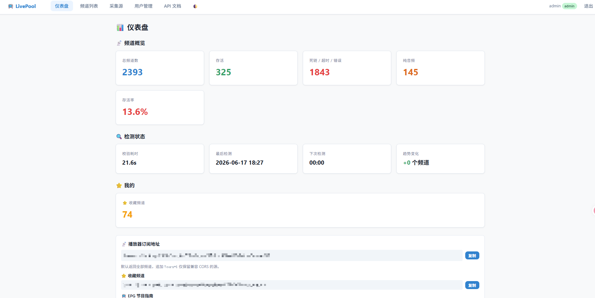
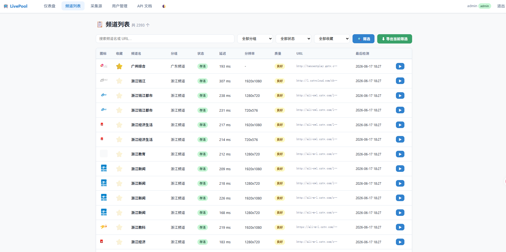
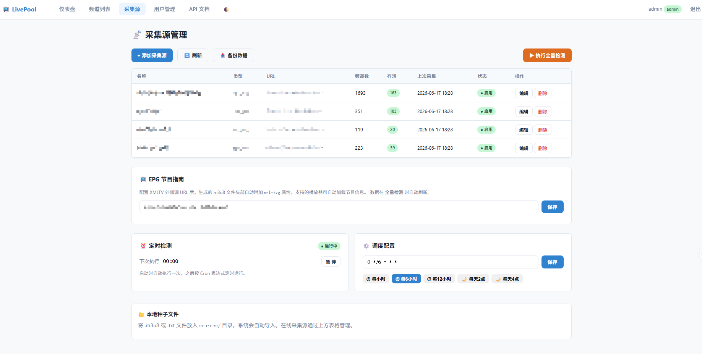
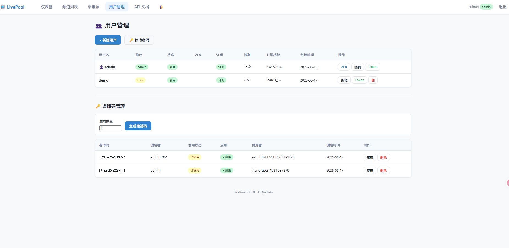

# 📺 LivePool

IPTV 电视直播源自动采集、校验、去重、分类、m3u8 生成系统。提供 Web 管理面板和 REST API。

## 截图

<table>
  <tr>
    <td></td>
    <td></td>
  </tr>
  <tr>
    <td align="center"><b>📊 仪表盘</b></td>
    <td align="center"><b>📋 频道列表</b></td>
  </tr>
  <tr>
    <td></td>
    <td></td>
  </tr>
  <tr>
    <td align="center"><b>📡 采集源管理</b></td>
    <td align="center"><b>👥 用户管理</b></td>
  </tr>
</table>

## 功能

- **采集** — 支持多源并发爬取（GitHub IPTV 仓库、公开 m3u8 链接），同时支持本地 m3u8/txt 种子文件导入
- **校验** — 异步高并发 HTTP 探测，四阶段深度检测（状态码 → 内容验证 → 媒体分段可达性 → NAL 视频流扫描），死链指数退避机制
- **过滤去重** — 自动淘汰死链，URL + 频道名智能去重，加权评分（稳定性 ×50、视频完整性 ×8、分辨率 ×~4、延迟 ×~100）保留最优源
- **分类** — 自动归类（央视频道、卫视频道、地方频道、海外频道等），支持 `channels.json` 手动映射覆盖
- **生成** — 输出标准 IPTV m3u8 文件，`#EXTINF` 包含 `group-title`、`tvg-id`、`tvg-logo` 等完整信息
- **EPG 节目指南** — 支持外部 XMLTV 源代理，m3u8 头部自动附加 `url-tvg`，播放器可自动发现节目信息
- **授权与安全** — JWT 认证、2FA/TOTP 二次验证、邀请码注册、订阅 Token 访问控制
- **Web 管理面板** — 仪表盘、频道列表（搜索/筛选/排序/收藏）、采集源管理、用户管理、调度配置
- **定时调度** — APScheduler 内嵌在 Web 进程中，支持 Cron 表达式，Web UI 可视化配置
- **Docker 部署** — 单容器运行，本地构建镜像，生产服务器仅加载运行

## 开始使用

### 环境要求

- Python 3.13+
- pip
- Docker（可选，用于生产部署）

### 本地运行

```bash
# 克隆仓库
git clone https://github.com/xyzbeta/livepool.git
cd livepool

# 安装依赖
pip install -r requirements.txt

# 编辑配置
vim config.yaml

# 一次性运行全流程（采集 → 校验 → 去重 → 分类 → 生成）
python3 src/main.py run

# 启动 Web 服务（默认 http://0.0.0.0:8008）
python3 src/main.py web
```

### Docker 镜像构建与部署

```bash
# 本地构建镜像
docker build -t livepool:latest .

# 导出并传输到服务器
docker save livepool:latest -o livepool-image.tar
scp livepool-image.tar root@your-server:/serverhub/livepool/

# 服务器加载并运行
ssh root@your-server
cd /serverhub/livepool
docker load -i livepool-image.tar
docker run -d \
  --name livepool \
  --restart unless-stopped \
  -p 8008:8008 \
  -v /serverhub/livepool/config.yaml:/app/config.yaml:ro \
  -v /serverhub/livepool/data:/app/data \
  -e TZ=Asia/Shanghai \
  -e JWT_SECRET=your-secret-key \
  livepool:latest
```

首次启动会自动创建管理员账号（默认用户名 `admin`，密码在 `config.yaml` 的 `auth.default_admin_password` 中设置），**请第一时间登录修改密码**。

### 一键构建部署

项目提供了 `build.sh` 脚本，自动完成构建、传输、加载、启动全流程：

```bash
./build.sh 服务器IP SSH端口
```

### 播放器订阅

登录 Web 仪表盘后，在页面底部复制您的专属订阅地址，填入 VLC、PotPlayer、TiviMate、IPTV Smarters 等播放器即可收看。

| 订阅类型 | URL 格式 | 说明 |
|---------|---------|------|
| 完整列表 | `/tv/{token}.m3u8` | 全部频道 |
| 收藏频道 | `/tv/{token}/favorites.m3u8` | 仅收藏的频道 |
| EPG 节目 | `/tv/{token}/epg.xml` | XMLTV 节目数据 |

## 配置说明

所有配置在 `config.yaml` 中，大部分项目可通过 Web UI 修改。

### 核心配置项

| 配置段 | 说明 | Web UI 可配 |
|-------|------|------------|
| `auth` | JWT 密钥、token 有效期、默认管理员密码 | ❌ |
| `collector` | 采集源列表、超时 | ✅ 采集源管理页 |
| `validator` | 并发数、超时、重试、深度检测 | ❌ |
| `classifier` | 频道分组映射 | ❌ |
| `generator` | m3u8 输出设置 | ❌ |
| `scheduler` | Cron 表达式、时区 | ✅ 采集源管理页 |
| `epg` | XMLTV 节目源 URL | ✅ 采集源管理页 |
| `web` | 监听地址、端口、CORS | ❌ |
| `logging` | 日志级别 | ❌ |

> **安全提醒**：生产环境务必通过 `$JWT_SECRET` 环境变量设置 JWT 签名密钥，不要使用 config.yaml 中的默认值。

## API 参考

### 认证

| 方法 | 端点 | 说明 |
|------|------|------|
| POST | `/api/auth/login` | 登录（支持 2FA） |
| POST | `/api/auth/register` | 邀请码注册 |
| POST | `/api/auth/logout` | 登出 |
| GET | `/api/auth/me` | 当前用户信息 |
| PUT | `/api/auth/me` | 修改密码/用户名 |

### 频道与订阅

| 方法 | 端点 | 说明 |
|------|------|------|
| GET | `/api/channels` | 频道列表（支持筛选/分页/排序） |
| GET | `/api/channels/{id}` | 频道详情 |
| GET | `/api/stats` | 系统统计 |
| GET | `/api/m3u8` | 下载完整 m3u8（需登录） |
| GET | `/api/epg.xml` | EPG 节目数据（XMLTV） |

### 订阅端点（Token 保护）

| 方法 | 端点 | 说明 |
|------|------|------|
| GET | `/api/subscribe/{token}` | 完整列表 |
| GET | `/api/subscribe/{token}/favorites` | 收藏频道 |
| GET | `/api/subscribe/{token}/epg` | EPG 数据 |
| GET | `/tv/{token}` | 短地址（同上） |

### 管理

| 方法 | 端点 | 说明 |
|------|------|------|
| GET/POST/PUT/DELETE | `/api/sources` | 采集源 CRUD |
| GET/POST/PUT/DELETE | `/api/users` | 用户管理 |
| POST | `/api/check` | 手动触发全量检测 |
| GET | `/api/tasks/{id}` | 任务进度 |
| GET/PUT | `/api/schedule` | 调度配置 |
| GET/POST | `/api/scheduler/status` | 调度器控制 |
| GET/POST/PUT/DELETE | `/api/invite-codes` | 邀请码管理 |
| GET/PUT | `/api/epg/config` | EPG 配置 |
| GET | `/api/backup` | 数据备份 |

## 架构概览

### 处理流水线

```
采集 (Collect) → 校验 (Validate) → 过滤 (Filter) → 分类 (Classify) → 生成 (Generate)
```

| 阶段 | 模块 | 说明 |
|------|------|------|
| 1. Collect | `collector.py` | 多源并发爬取 + 本地种子导入，按 URL 去重 |
| 2. Validate | `validator.py` | 异步并发 HTTP 探测，4 级深度检测 + 死链退避 |
| 3. Filter | `filter.py` | 分离存活/死亡流，加权评分去重 |
| 4. Classify | `classifier.py` | 自动归类 + channels.json 手动映射 |
| 5. Generate | `generator.py` | 输出标准 IPTV m3u8 |
| 6. EPG | `epg.py` | XMLTV 节目数据缓存与代理 |

### 项目结构

```
livepool/
├── config.yaml           # 主配置文件
├── Dockerfile            # 容器镜像
├── build.sh              # 构建部署脚本
├── run.sh                # 生产启动脚本
├── requirements.txt      # Python 依赖
├── images/               # README 截图
├── src/                  # 源码
│   ├── main.py           # CLI 入口
│   ├── config.py         # 配置加载器
│   ├── store.py          # SQLite 存储层
│   ├── auth.py           # JWT + 密码 + 注册
│   ├── api.py            # FastAPI 路由
│   ├── scheduler.py      # 流水线编排 + APScheduler
│   ├── collector.py      # 采集器
│   ├── validator.py      # 四阶段校验器
│   ├── filter.py         # 去重 + 加权评分
│   ├── classifier.py     # 频道分类
│   ├── generator.py      # m3u8 生成
│   ├── parser.py         # EXTINF 解析
│   ├── epg.py            # EPG 代理模块
│   ├── sources/          # 爬虫插件
│   └── templates/        # Jinja2 模板
└── static/               # CSS 样式
```

### 数据目录（运行时）

```
data/
├── livepool.db           # SQLite 数据库
├── live.m3u8             # 主播放列表
├── app.log               # 运行日志
├── by_group/             # 分组播放列表
├── logos/                # 频道图标缓存
├── sources/              # 本地种子文件
├── last_check.json       # 校验退避记录
└── epg_cache.xml         # EPG 节目数据缓存
```

## 技术栈

- **运行环境**: Python 3.13+
- **Web 框架**: FastAPI + Uvicorn
- **模板引擎**: Jinja2
- **持久化**: SQLite (aiosqlite)
- **HTTP 客户端**: aiohttp
- **定时调度**: APScheduler
- **认证**: pyjwt + bcrypt + pyotp (2FA)
- **容器化**: Docker
- **依赖管理**: pip + requirements.txt

## License

MIT
